# ArduTester v1.08k OLED

Electronic project for use an Arduino Nano as an electronics components identifier.  
Schematics diagram + PCB diagram (KiCAD 9) and case 3D model (Blender) are also provided.  

This project is a **work-in-progress**.

Based on the well-known **TransistorTester** work of [Karl-Heinz Kübbeler](https://github.com/kubi48/).

Useful links:  
- [TransistorTester oficial GitHub](https://github.com/kubi48/TransistorTester-source)  
- [Mikrocontroller.net](https://www.mikrocontroller.net/articles/AVR_Transistortester)  
- [Mikrocontroller.net GitHub](https://github.com/Mikrocontroller-net/transistortester/)  

Aditional resources:
- [Electgpl@YouTube.com: Video tutorial: ArduTester + OLED display](https://www.youtube.com/watch?v=M8jgcR9IcJU) [spanish]
- [ElProfeGarcia@YouTube.com: Video tutorial: ArduTester component tester](https://www.youtube.com/watch?v=7o1T-6169ZE) [spanish]
- [Electronoobs@YouTube.com: Video tutorial: component test with Arduino + TFT display](https://www.youtube.com/watch?v=lsy2g0oz0Dk) [spanish]
- [Electronoobs.com blog](https://electronoobs.com/eng_arduino_tut191.php) [spanish]
- [BawejaAkshay@Instructables.com: ArduTester version #1](https://www.instructables.com/Component-Tester-Test-Almost-Anything-/)
- [BawejaAkshay@Instructables.com: ArduTester version #2](https://www.instructables.com/Component-Tester-in-a-Keychain/)
- [Lithium-Ion@Hackster.io blog](https://www.hackster.io/LithiumION/minimal-component-tester-using-arduino-b7b960)
- [RiverTrue@DFRobot.com blog](https://community.dfrobot.com/makelog-312328.html)
- [Plouc68000@ProjectHub.arduino.cc blog](https://projecthub.arduino.cc/plouc68000/ardutester-v113-the-arduino-uno-transistor-tester-2deffc)
- [ChristianIhle@GitHub.com blog](https://github.com/blurpy/transistor-tester)

&nbsp;

This project comes in two versions: `standard` (current) and `extended` (planned). See features bellow.

Features:
- One-key-operation.
- Three test pins for universal use.
- Automated detection of pin assignment, this means the device-under-test can be connected to the tester in any order.

Supported components:
- `Diodes`, `LEDs` and `Zeners`.
  - Diodes will also be displayed with their correctly aligned symbol, pin number, voltage drop, the parasitic capacitance and reverse current will also be measured.
- `Transistors` NPN/PNP BJT, JFET, N-channel/P-channel MOSFET.
  - Measurement of hFE and base-emitter-voltage for bipolar junction transistors, also for Darlingtons.
  - Automated detection of protection diodes in bipolar junction transistors and MOSFETs.
  - Bipolar junction transistors are detected as a transistor with a parasitic transistor (NPNp = NPN + parasitic PNP).
- `Resistors` will be measured with a resolution down to 0.1 ohm.  
  The measurement range is up to 50 Mohm (Megaohm).  
  Resistors below 10 ohm will be measured with the ESR approach and a resolution of 0.01 ohm.
- `Capacitors` in the range 35pF (picofarad) to 100mF (millifarad) can be measured with a resolution down to 1 pF.
  - Measurement of ESR (Equivalent Series Resistance) of capacitors greater than 20 nF is built in. 
  - Vloss of capacitors greater 5 nF is examined. With this it is possible to estimate its Q-factor.
- Resistors and capacitors will be displayed with their respective symbol, pin number and value.
- `Inductances` of 0.01 mH to 20 H can be detected and measured.
- Small `Thyristors` and `TRIACs`.

Notes:
- Be sure to **discharge capacitors** before measure it. Existing voltage can damage your Arduino.

&nbsp;

### List of Materials

The `standard` version uses the following electronic components:
- 1 x Arduino Nano v3
- 1 x OLED display 0.96" 128x64 I2C
- 3 x 680 ohm resistor
- 3 x 470k ohm resistor
- 1 x Push switch button
- 1 x 10k ohm resistor
- 1 x Socket connector 5-pins
- 1 x Bornier connector 2-pins / JST connector 2-pins
- 1 x Bornier connector 3-pins / JST connector 3-pins
- 1 x Bornier connector 4-pins / JST connector 4-pins
- Wires

&nbsp;

### Screenshots

| Breadboard                                           | Assembly                                             |
|------------------------------------------------------|------------------------------------------------------|
| 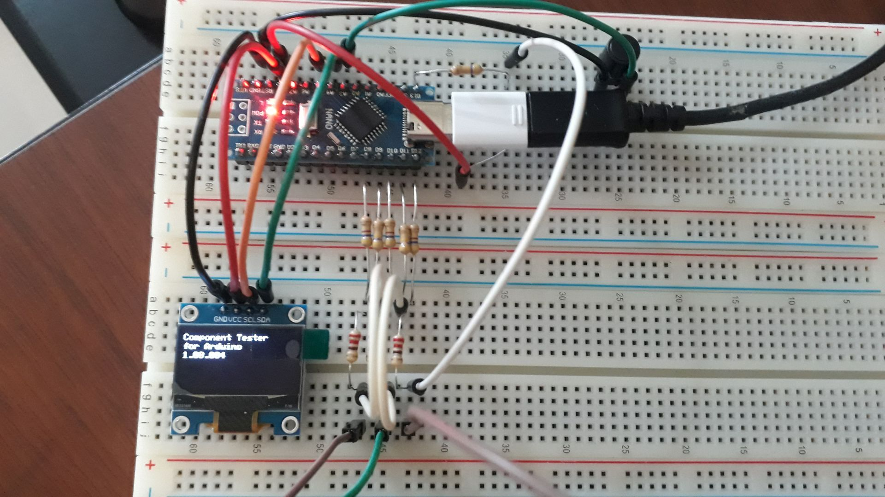            | 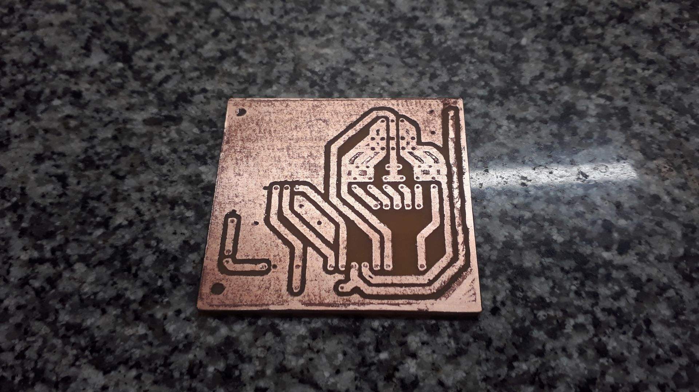           |

| Assembly                                             | Assembly                                             |
|------------------------------------------------------|------------------------------------------------------|
| 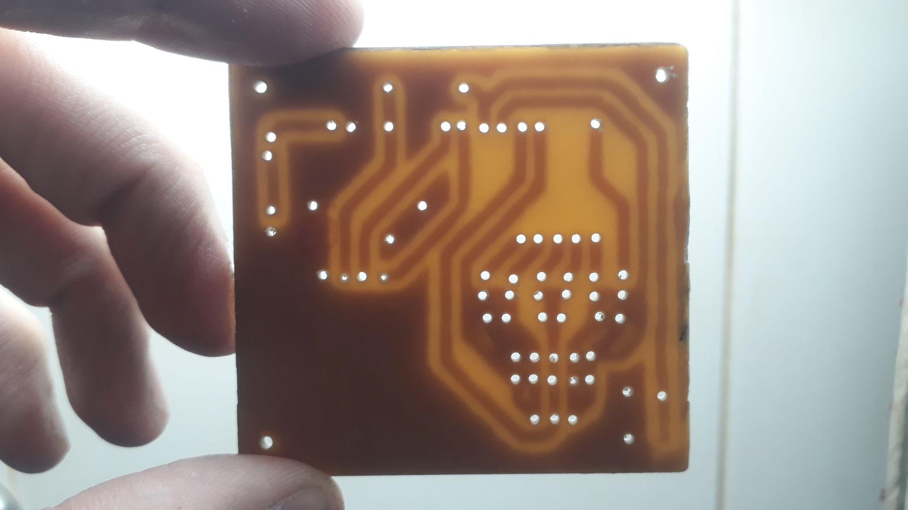           | 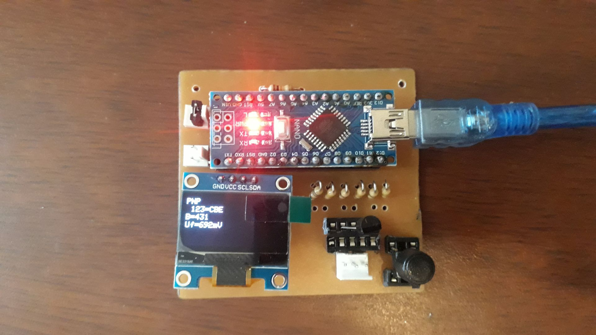           |

| Schematics Diagram                                   | PCB Diagram                                          |
|------------------------------------------------------|------------------------------------------------------|
| 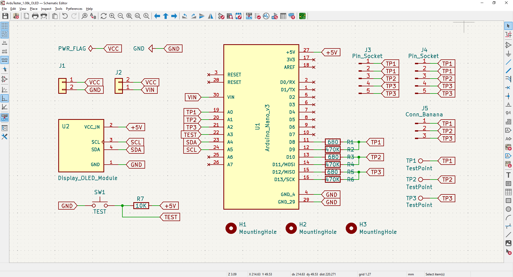    | 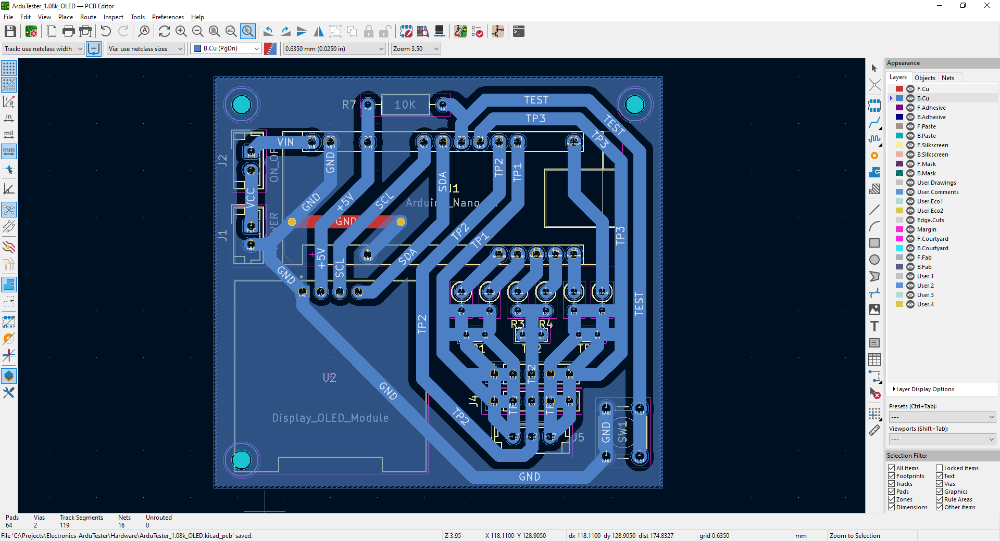           |

| PCB Render 3D                                        | PCB Render 3D                                        |
|------------------------------------------------------|------------------------------------------------------|
| 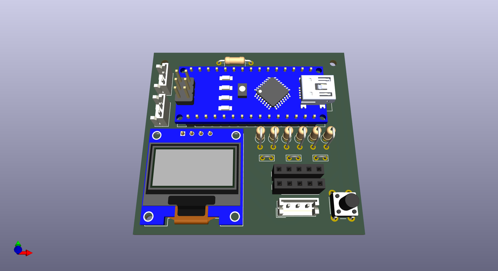   | 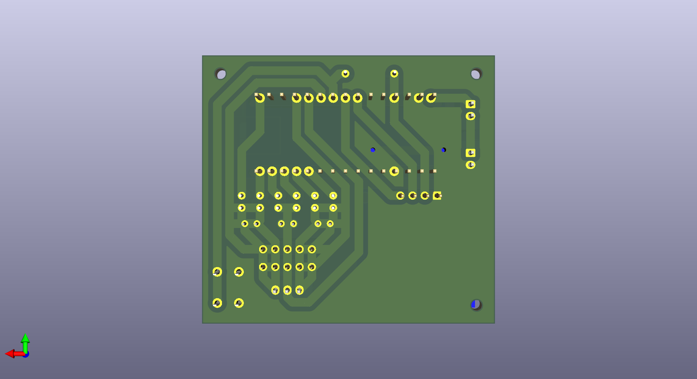  |

| Case 3D Model                                        | Project Final                                        |
|------------------------------------------------------|------------------------------------------------------|
| 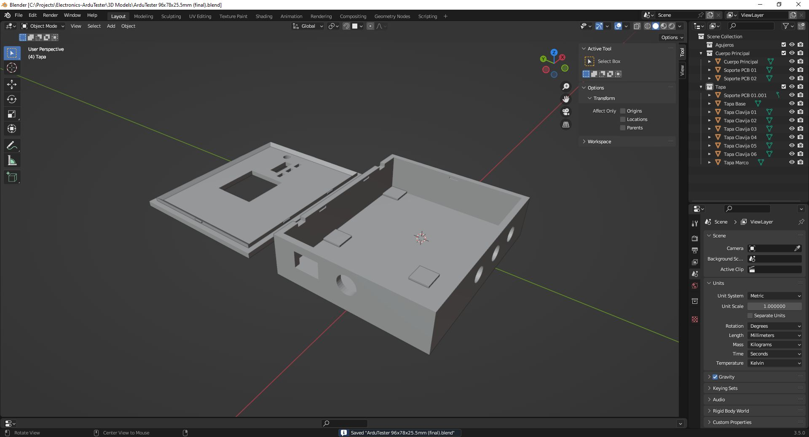         | 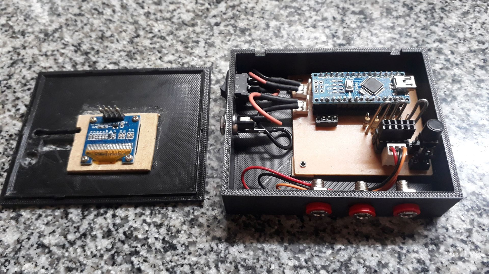      |

| Project Final                                        | Project Final                                        |
|------------------------------------------------------|------------------------------------------------------|
| 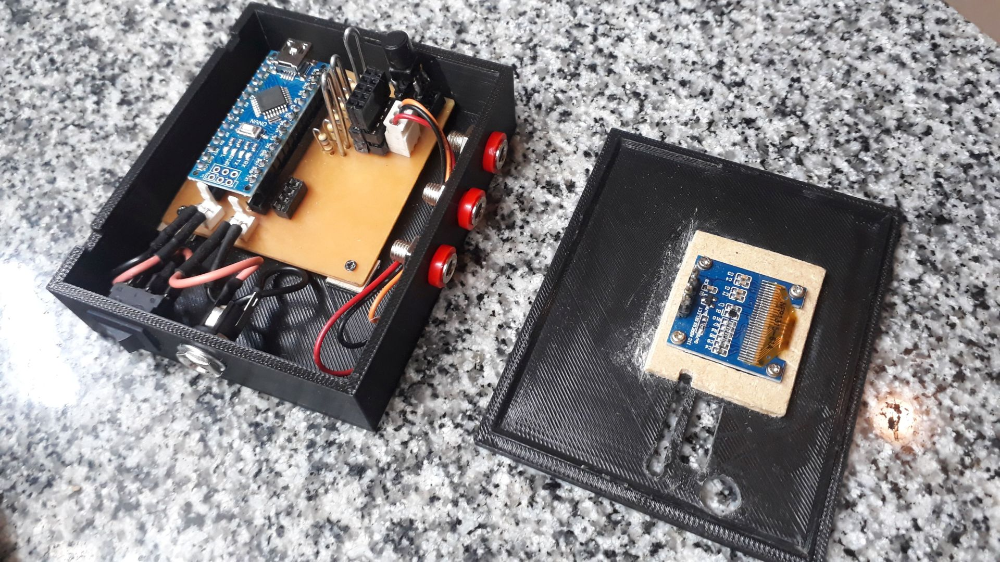      | 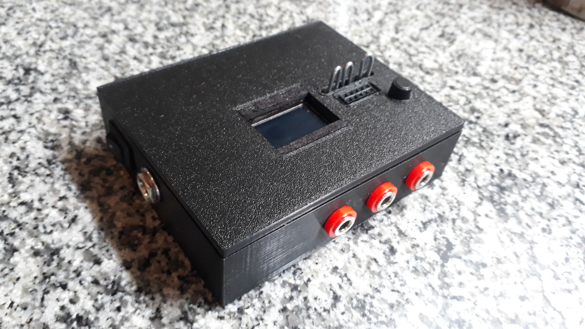      |

See 'Rescources' sub-folder for more pictures & videos of the project.

&nbsp;

### Version History

v1.0 (2026.01.04) - Initial release.  
v1.1 (2026.01.05) - Added schematics and PCB diagrams.  
v1.2 (2026.01.05) - Added 3D case model.  
v1.3 (2026.01.06) - Firmware and PCB fixes.  
v1.4 (2026.01.06) - 3D case model fixes.  
v1.4 (2026.01.06) - Minor case 3D model fixes.  
v1.5 (2026.01.09) - Minor fixes on PCB.  
v1.6 (2026.01.14) - Minor fixes on PCB.  
v1.7 (2026.01.16) - Re-design of PCB and 3D case model.  
v1.8 (2026.02.03) - Minor cases 3D model fixes.  
v1.9 (2026.02.04) - Added gadget images & video.  

&nbsp;

This source code is licensed under GPL v3.0  
Please send me your feedback about this project: andres.garcia.alves@gmail.com
